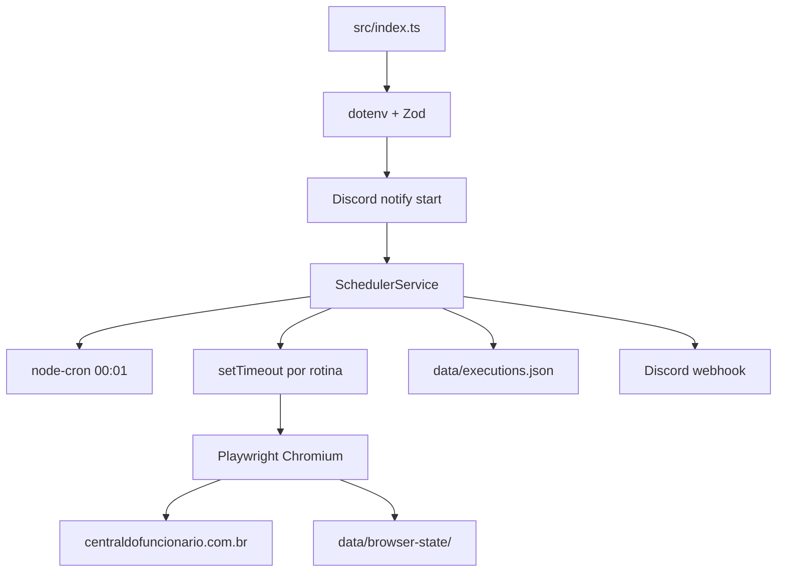

# Discovery Técnica: secullum-web-automate (Bot de Ponto)

> Documento de levantamento técnico. **Não** implica Compose definitivo, deploy ou container em produção.  
> Projeto analisado: repositório da aplicação `secullum-web-automate` (`central-funcionario-bot`).  
> Infraalvo: este repositório `oracle-infra` (ARM64, GHCR, CI/CD reutilizável, Discord de pipeline, backup).  
> Status do serviço: **experimental** até os critérios da seção 31.13.

---

## 1. Resumo Executivo

Sistema **automação de registro de ponto** no portal **Central do Funcionário**, via **Playwright (Chromium)** em processo Node long-running.

Objetivo: agendar 4 batidas diárias (entrada, saída almoço, retorno, saída) com variação aleatória de ±5 min, persistir sessão/cookies e estado de execução, opcionalmente notificar Discord e só clicar o registro final se `ALLOW_FINAL_CLICK=true`.

Arquitetura geral: **worker cron + browser automation** — sem API HTTP, sem banco, sem fila. Processo único que agenda `setTimeout`s e um cron de meia-noite.



**Conclusão-chave para a VPS:** candidato natural a `bot-ponto` no roadmap `oracle-infra`. Exige **saída HTTPS** (portal + Discord). **Decisão fechada:** não usar rede Docker `internal` isolada; usar bridge própria com outbound, sem portas/Traefik.

> Este documento inclui o **Complemento — Preparação para Produção** (seção 31+). O complemento **não autoriza implementação**; apenas enriquece a Discovery.

---

## 2. Stack

| Item | Valor |
|------|--------|
| Linguagem | TypeScript (strict) → CommonJS |
| Runtime | Node.js `>=20` |
| Framework web | Nenhum |
| Automação | Playwright `1.61.0` (Chromium) |
| Scheduler | `node-cron` + `setTimeout` |
| Validação config | Zod |
| Datas | Luxon |
| Package manager | npm (`package-lock.json` v3) |
| Build | `tsc` |
| Nome npm | `central-funcionario-bot@1.0.0` |
| Licença | UNLICENSED |

---

## 3. Estrutura

```text
secullum-web-automate/
├── src/
│   ├── index.ts                      # bootstrap + signals
│   ├── config/                       # env + config.json
│   ├── scheduler/                    # planejamento diário
│   ├── automation/                   # browser + fluxo ponto
│   ├── notifications/                # Discord webhook
│   ├── utils/                        # logger, random, wait
│   └── scripts/test-automation.ts    # teste headed one-shot
├── config.json                       # horários
├── Dockerfile / docker-compose.yml   # já existem (dev/local)
├── .env.example / README.md
└── data/                             # runtime (gitignored)
```

| Módulo | Responsabilidade |
|--------|------------------|
| `config` | Carrega/valida `.env` e `config.json` |
| `scheduler` | Planeja dia, persiste execuções, dispara bot |
| `automation` | Chromium, login, fluxo “Incluir ponto” |
| `notifications` | Embeds Discord (start/plan/success/error) |
| `utils` | Logger, janela aleatória, geolocalização |

---

## 4. Dependências

### Críticas (produção)

| Pacote | Uso | Risco |
|--------|-----|-------|
| `playwright@1.61.0` | Chromium + automation | Alto em ARM64 (binários/imagem) |
| `node-cron` | Replanejamento diário | Baixo |
| `luxon` | Timezone agendamento/logs | Baixo |
| `zod` | Validação env/config | Baixo |
| `dotenv` | `.env` | Baixo |

### Desenvolvimento

`typescript`, `tsx`, `@types/*`

### Opcionais / runtime implícitos

- Imagem `mcr.microsoft.com/playwright:v1.61.0-jammy` (browsers pré-instalados)
- `shm` ≥ 1GB para estabilidade do Chromium

### Abandonadas / sem manutenção

Nenhuma dependência claramente abandonada. Stack moderna e enxuta.

### Riscos de cadeia

- Pin explícito Playwright vs range no lockfile histórico: manter versões imagem Docker e pacote alinhadas (já documentado no Dockerfile).

---

## 5. Processo de Build

| Etapa | Comando |
|-------|---------|
| Install | `npm ci` |
| Browsers (host sem imagem Playwright) | `npx playwright install chromium` |
| Build | `npm run build` → `tsc` → `dist/` |
| Start prod | `npm start` → `node dist/index.js` |
| Dev | `npm run dev` → `tsx watch src/index.ts` |
| Teste headed | `npm run test:automation` |

**Artefatos:** `dist/**/*.js` (+ `config.json` copiado na imagem).

**Tempo aproximado:** `npm ci` + `tsc` ~1–3 min; imagem Playwright base é pesada (centenas de MB–GB) — pull/build ARM64 pode levar vários minutos na VPS.

---

## 6. Processo de Inicialização

Ordem em `src/index.ts` do repositório da aplicação:

1. `loadAppConfig()` (dotenv + Zod; falha → exit 1)
2. `initLogger(timezone)`
3. Log de contexto + `DiscordNotifier.notifyBotStarted`
4. `SchedulerService` carrega `config.json` + `executions.json`
5. `scheduler.start()`: planeja timeouts do dia + cron `1 0 * * *`
6. Registra SIGINT/SIGTERM
7. Processo permanece vivo (sem `listen`)

Antes do “servidor”: não há servidor HTTP. Depois: apenas timers + cron.

---

## 7. Processo de Encerramento

| Sinal | Tratado? | Comportamento atual |
|-------|----------|---------------------|
| SIGINT | Sim | `scheduler.stop()` + `process.exit(0)` |
| SIGTERM | Sim | Idem |
| Graceful wait job ativo | **Não** | Não aguarda Playwright em voo |
| Close browser / flush state | **Não garantido** | Exit imediato pode cortar `storageState` |

Compose local já usa `stop_grace_period: 30s` / `init: true`, mas a app não aproveita a janela para drain.

**Requisito futuro obrigatório (graceful shutdown):**

1. Parar novos agendamentos  
2. Aguardar execução atual  
3. Salvar estado operacional  
4. Persistir sessão Playwright  
5. Fechar navegador  
6. Liberar recursos (locks)  
7. Encerrar processo  

Não interromper automação em andamento sem tentativa de finalização segura. Align `stop_grace_period` do Compose com timeout realista (ex.: 60–120s).

---

## 8. Persistência

| Dado | Caminho padrão | Backup? |
|------|----------------|---------|
| Sessão Playwright (cookies) | `data/browser-state/storageState.json` | **Sim** (crítico; mode 600) |
| Estado agendas / operacional | `data/` / futuro `state/` | **Sim** |
| Heartbeat | futuro `state/heartbeat.json` | **Sim** (pequeno) |
| Lock file | futuro `state/automation.lock` | Não (efêmero) |
| Screenshots | `screenshots/AAAA/MM/DD/` (futuro) | Opcional (retenção 14d) |
| Horários | `config.json` (versionável) | Via Git / volume ro |
| Segredos | `.env` na VPS | Fora do backup Git; não versionar |

Sem Postgres/Redis/Mongo/SQLite. Sem uploads. Cache = estado do browser.

---

## 9. Banco de Dados

**Não existe.** Sem migrations/seeds. Backup = arquivos em `/opt/docker/<service>/`.

---

## 10. Variáveis de Ambiente

| Variável | Obr. | Default | Uso |
|----------|------|---------|-----|
| `CENTRAL_URL` | Sim | — | URL do portal (inclui código empresa) |
| `CENTRAL_NUMERO_FOLHA` | Sim | — | Login |
| `CENTRAL_PASSWORD` | Sim | — | Senha |
| `HEADLESS` | Não | `true` | Chromium headless |
| `TIMEZONE` | Não | `America/Campo_Grande` | Agendamento/logs |
| `ALLOW_FINAL_CLICK` | Não | `false` | Gate do clique real |
| `BROWSER_STATE_PATH` | Não | `./data/browser-state/storageState.json` | Sessão |
| `EXECUTIONS_STATE_PATH` | Não | `./data/executions.json` | Estado jobs |
| `CONFIG_PATH` | Não | `./config.json` | Horários |
| `BROWSER_HOLD_SECONDS` | Não | `0` | Hold pós-execução |
| `GEOLOCATION_LATITUDE` | Não | — | Spoof geo |
| `GEOLOCATION_LONGITUDE` | Não | — | Spoof geo |
| `GEOLOCATION_RADIUS_METERS` | Não | `10` | Raio aleatório |
| `WEBHOOK_DISCORD_URL` | Não | off | Discord |
| `TZ` | Infra | — | OS/container timezone |
| `NODE_ENV` | Infra | — | Dockerfile |
| `PLAYWRIGHT_SKIP_BROWSER_DOWNLOAD` | Infra | `1` na imagem | Evita redownload |

**Alerta de segurança:** o `.env.example` do repositório da aplicação continha URL real de webhook Discord versionada. Rotacionar imediatamente antes de produção; deixar vazio no example.

---

## 11. Integrações Externas

| Sistema | Tipo | Direção |
|---------|------|---------|
| Central do Funcionário | Web UI HTTPS | Outbound browser |
| Discord Webhook | HTTPS POST | Outbound opcional |
| Telegram / AWS / Firebase / SMTP | — | Ausentes |

---

## 12. Scheduler

- Cron meia-noite+1min: replanejamento diário
- 4 rotinas uteis em `config.json` (07:30, 11:30, 12:35, 16:40 ±5 min)
- Sem BullMQ/Agenda/workers separados
- Reinício após fechar janela do dia = batida perdida até o dia seguinte (limitação documentada)

---

## 13. Comunicação

Somente outbound HTTPS (portal + webhook). Sem REST/GraphQL/WebSocket/SSE inbound.

---

## 14. Portas

| Item | Valor |
|------|-------|
| Servidor HTTP | **Não** |
| Porta | N/A |
| Traefik | Não necessário |
| Rede | Precisa **egress**; não “HTTP interno” |

Pode (e deve) rodar sem HTTP público.

---

## 15. Health Check

| Atual | Nenhum endpoint / Docker HEALTHCHECK |
|-------|--------------------------------------|

**Requisito futuro:** heartbeat persistente em `/opt/docker/bot-ponto/state/heartbeat.json` (ver seção 31.3), atualizado após cada execução relevante.

Estratégia de health recomendada:

1. **Infra/deploy:** `health_mode: running` + (futuro) `exec` lendo idade/`status` do heartbeat  
2. **Uptime Kuma:** container up + checagem periódica do heartbeat (arquivo ou script)  
3. **Funcional:** Discord do bot (última falha/sucesso) ≠ Discord do CI/CD  

Não inventar HTTP público só para health.

---

## 16. Logs

Logger custom console (`src/utils/logger.ts`): níveis info/warn/error, timestamp Luxon, sem Winston/Pino/rotação em arquivo. Adequado a Dozzle via `docker logs`.

**Produção (avaliação futura, sem substituir agora):** logs estruturados JSON (nível, contexto da rotina, correlation id da execução) para filtros no Dozzle e integrações. Manter logger atual até fase de endurecimento.

---

## 17. Docker (estado atual do repo)

| Item | Status |
|------|--------|
| Dockerfile | Sim, multi-stage Playwright jammy |
| Compose | Sim, serviço `bot`, volume `data`, `shm_size: 1gb` |
| Healthcheck | Não |
| Non-root | Não (roda como default da imagem) |
| Portas publicadas | Não |
| ARM64 explícito | Não declarado; **precisa validação** |

Compose atual é padrão de desenvolvimento local — **não** é o Compose definitivo para `oracle-infra` (`/opt/docker`, redes `proxy`/`internal`, template).

---

## 18. Compatibilidade ARM64

| Fator | Avaliação |
|-------|-----------|
| JS puro (zod/luxon/cron) | OK |
| Playwright/Chromium | **Risco Alto** — validar imagem `playwright:v1.61.0-jammy` em `linux/arm64` |
| sharp/puppeteer extras | Ausentes |
| node-gyp nativo | Baixo além do browser |

**Gate obrigatório ARM64 (antes de qualquer acesso ao portal):** ver protocolo completo na seção 31.1. Sem esse gate aprovado, não há migração nem dry-run no Central.

---

## 19. Recursos (estimativa)

| Recurso | Estimativa |
|---------|------------|
| RAM idle | ~50–150 MB (Node) |
| RAM pico (Chromium) | **512 MB–1.5 GB** |
| CPU | Baixa na maior parte; picos curtos nas batidas |
| Disco | Imagem grande (~1–2 GB+) + `data/` pequeno (MB) |
| Rede | Picos curtos outbound HTTPS 4×/dia útil |
| shm | **1 GB** recomendado (já no compose local) |

VPS Ampere A1: viável se memória livre &gt; ~2 GB além dos 4 serviços de infra.

---

## 20. Segurança

| Achado | Severidade |
|--------|------------|
| Webhook Discord real em `.env.example` | **Crítico** — rotacionar |
| Credenciais Central em `.env` local | Alto se leak/histórico Git |
| `storageState.json` = sessão autenticada | Alto se volume vazado |
| Sem Helmet/CORS/rate-limit (N/A sem HTTP) | — |
| `ALLOW_FINAL_CLICK` default false | Bom controle |
| Sem usuário non-root no container | Médio |
| Geolocalização fake | Conformidade/risco legal/trabalhista (fora escopo técnico puro) |

---

## 21. Observabilidade na infra existente

| Ferramenta | Papel |
|------------|--------|
| Dozzle | Logs stdout (infra) |
| Uptime Kuma | Container up + futuro probe de heartbeat (infra/funcional) |
| Discord bot (`BOT_DISCORD_WEBHOOK`) | Eventos funcionais |
| Discord CI (`CI_DISCORD_WEBHOOK`) | Deploy/rollback — canal separado |
| Heartbeat file | Fonte de verdade para health funcional |
| Health deploy CD | `running` agora; `exec` sobre heartbeat após implementação |

Ver divisão infra vs funcional na seção 31.12.

---

## 22. Deploy recomendado (apenas recomendação)

1. Tratar como serviço `bot-ponto` em `oracle-infra` usando [`templates/docker-service`](../../templates/docker-service/).
2. Imagem GHCR `ghcr.io/<owner>/bot-ponto:sha-<commit>` (ou nome alinhado ao repo).
3. Persistência: `/opt/docker/bot-ponto/` → `browser-state`, `executions`, `screenshots`.
4. Rede: **bridge própria do projeto com outbound** (ex.: `bot-ponto-net`). **Proibido** `internal` isolado. Sem portas publicadas, sem Traefik, sem labels HTTP. Egress apenas para Central, Discord e APIs autorizadas.
5. Sem Traefik, sem porta publicada.
6. `shm_size: 1gb`, `init: true`, `TZ=America/Campo_Grande`.
7. Secrets só no `.env` da VPS / Environment GitHub.
8. Rollout inicial com `ALLOW_FINAL_CLICK=false` (dry-run) até validar seleção/UI/ARM64.
9. Usar `scripts/ci-deploy-service.sh` / workflows `@v1` do `oracle-infra` (ainda experimental até 1º deploy real).

---

## 23. CI/CD (base reutilizável)

Adaptações necessárias no **repo da app** (futuro, não agora):

| Peça | Adaptação |
|------|-----------|
| Testes caller | Smoke/unit leves; automation E2E headed **não** no CI cloud sem browser service |
| `reusable-docker-build@v1` | Context `.`, Dockerfile existente; plataforma `linux/arm64` |
| Tags | Preferir `sha-<commit>` |
| `reusable-vps-deploy@v1` | `compose_dir: compose/bot-ponto`, health `running`, `shm` no Compose |
| Secrets | `CENTRAL_*`, `WEBHOOK_*`, paths; **não** reutilizar webhook vazado |
| Discord CD | Secret **separado** `CI_DISCORD_WEBHOOK` / `DISCORD_WEBHOOK_URL` do pipeline — **nunca** o mesmo do bot |
| Discord bot | Env `BOT_DISCORD_WEBHOOK` (ou renomear `WEBHOOK_DISCORD_URL`) só no runtime do serviço |

Dockerfile atual já multi-stage e adequado como base; validar ARM64 e non-root como melhorias futuras.

---

## 24. Backup

**Incluir**

- `/opt/docker/bot-ponto/browser-state/`
- `/opt/docker/bot-ponto/executions.json` (ou dir)
- Opcional: screenshots recentes
- `/opt/docker/deploy-state/bot-ponto/` (estado CD)

**Excluir / não versionar**

- `.env`
- `node_modules`, browsers baixados fora da imagem
- Secrets Discord/Central

Backup infra já cobre `/opt/docker` se o volume estiver sob esse root.

---

## 25. Restore

Cuidados:

1. Restaurar `storageState` **antes** de subir o bot (sessão).
2. Restaurar `executions.json` evita reexecutar rotinas já `completed` no mesmo dia — ou limpar se quiser reprocessar.
3. Após restore de senha/empresa mudada: limpar `storageState` e forçar login limpo.
4. Não misturar estado de dry-run vs produção sem revisar `ALLOW_FINAL_CLICK`.

---

## 26. Rollback

| Camada | Risco |
|--------|-------|
| Imagem anterior | Baixo–médio (seletores UI podem divergir do portal) |
| Banco | N/A |
| `storageState` incompatível | Médio — login pode falhar |
| `executions.json` | Médio — pode marcar dia como concluído indevidamente |
| Cache | N/A além do browser state |

Rollback de imagem **não** desfaz ponto já registrado no portal externo.

---

## 27. Checklist pré-produção

### Gate bloqueante (seção 31.13)

- [ ] Playwright ARM64 validado (build + Chromium + página simples + memória/tempo)
- [ ] Chromium estável na Ampere
- [ ] Sessão persistente validada
- [ ] Heartbeat persistente funcionando
- [ ] Graceful shutdown implementado
- [ ] Lock de execução implementado
- [ ] Webhook exposto rotacionado + examples limpos
- [ ] Healthcheck definido (baseado em heartbeat)
- [ ] Backup validado
- [ ] Restore validado
- [ ] Deploy validado
- [ ] Rollback validado
- [ ] Monitoramento operacional validado

### Demais itens

- [ ] Rede bridge própria com egress (sem `internal`, sem Traefik/ports)
- [ ] Compose sob `/opt/infra/compose/bot-ponto`
- [ ] Volume `/opt/docker/bot-ponto` + permissões restritas (dirs 700 / sessão 600)
- [ ] Webhooks separados: `BOT_DISCORD_WEBHOOK` ≠ `CI_DISCORD_WEBHOOK`
- [ ] Secrets VPS + GitHub Environment no repo do serviço
- [ ] `shm_size: 1gb`, timezone Campo Grande
- [ ] Dry-run `ALLOW_FINAL_CLICK=false` **após** gate ARM64 (ainda sem batida real)
- [ ] Validar seletores UI pós-login
- [ ] Só então `ALLOW_FINAL_CLICK=true`
- [ ] Screenshots por data + retenção
- [ ] Documentar update/restart/rollback vs timers do dia
- [ ] Non-root documentado (pode ser pós go-live controlado)
- [ ] Enquanto critérios do gate não fecharem: pipeline permanece **experimental**

---

## 28. Riscos

| Risco | Nível |
|-------|-------|
| Webhook Discord commitado | **Crítico** |
| Playwright/ARM64 incompatível | **Alto** |
| Rede `internal` sem egress | **Alto** (se aplicada cegamente) |
| Seletores UI quebram no portal | **Alto** |
| Shutdown mata Chromium mid-run | **Médio** |
| Sessão roubada via volume | **Alto** |
| Memória insuficiente (Chromium) | **Médio** |
| Missed run após restart tardio | **Médio** |
| Conformidade geolocalização/spoof | **Médio–Alto** (negócio/legal) |
| CI experimental oracle-infra | **Médio** até 1º deploy |
| Imagem root | **Baixo–Médio** |

---

## 29. Débitos Técnicos

1. Remover segredo do `.env.example`; rotacionar webhook; separar BOT vs CI  
2. Gate ARM64 (31.1) antes do portal  
3. Graceful shutdown completo (seq. seção 7)  
4. Lock `flock` no volume (31.4)  
5. Heartbeat + estado enriquecido (31.3 / 31.6)  
6. Screenshots datados + retenção 14d  
7. Rede bridge própria; atualizar docs `oracle-infra` sobre bots com egress  
8. Healthcheck baseado em heartbeat  
9. Logs JSON (fase endurecimento)  
10. Non-root (documentado; pode ser pós go-live controlado)  
11. Runbook de update fora da janela de batidas  
12. Testes smoke CI sem GUI (não E2E headed obrigatório no cloud)

---

## 30. Plano de Implantação (etapas futuras)

**Fase 0 — Segurança:** rotacionar webhook; scrub example; auditar Git history; separar `BOT_` vs `CI_` webhooks.

**Fase 1 — Gate ARM64 (31.1):** build `linux/arm64`, Chromium, página simples, métricas memória/tempo — **sem** Central do Funcionário.

**Fase 2 — Fundamentos de runtime:** lock de execução, graceful shutdown, heartbeat + estado enriquecido, screenshots datados + retenção.

**Fase 3 — Compose na infra:** `compose/bot-ponto`, volume `/opt/docker/bot-ponto`, rede bridge própria com egress, sem Traefik/ports, `shm_size: 1gb`.

**Fase 4 — Dry-run funcional:** `ALLOW_FINAL_CLICK=false` na VPS; sessão persistente; Dozzle/Kuma; seletores.

**Fase 5 — CI/CD:** callers `@v1`, publish arm64, deploy dry-run → real; pipeline permanece experimental até critérios 31.13.

**Fase 6 — Produção controlada:** `ALLOW_FINAL_CLICK=true` supervisionado; backup/restore/rollback validados; runbook de update sem perder batida.

**Fase 7 — Endurecimento:** logs JSON, non-root, política de rede documentada no `oracle-infra`, refinamentos de observabilidade.

---

## 31. Complemento — Preparação para Produção

Complemento revisado pós-Discovery. **Não substitui** as seções 1–30. **Não autoriza implementação.**

### 31.1 Validação obrigatória Playwright ARM64

Antes de qualquer migração e **antes** de acessar o portal Central:

| Passo | Critério de aceite |
|-------|-------------------|
| Build imagem `linux/arm64` | Build conclui sem erro |
| Start Chromium | Launch headless OK |
| Abrir página simples | `about:blank` ou `example.com` carrega |
| Encerrar browser | `close()` limpo, sem hang |
| Memória | Pico medido e documentado (baseline) |
| Tempo de init | Cold start browser documentado |

Falha em qualquer passo = bloqueio de implantação até resolução.

### 31.2 Política de rede (decisão)

| Regra | Decisão |
|-------|---------|
| Rede `internal` isolada | **Proibida** para este serviço |
| Portas publicadas | Não |
| Traefik / labels HTTP | Não |
| Solução | Bridge própria do projeto com outbound (ex.: `bot-ponto-net`) |
| Egress permitido | Central do Funcionário, Discord (bot), APIs externas autorizadas no futuro |

Atualizar futuramente a documentação genérica do `oracle-infra` (“bots → internal”) para distinguir bots sem egress vs bots com egress necessário.

### 31.3 Heartbeat operacional

Container up ≠ serviço saudável.

Estrutura recomendada:

```text
/opt/docker/bot-ponto/state/heartbeat.json
```

Conteúdo mínimo sugerido:

```json
{
  "lastExecution": "...",
  "lastSuccess": "...",
  "nextExecution": "...",
  "status": "ok"
}
```

Atualizar após cada execução relevante. Healthcheck futuro da infra/CD deve consumir este arquivo (`exec` / script), não apenas `docker inspect` Running.

### 31.4 Lock de execução (estratégia recomendada)

**Escolha:** `flock` (file lock) sobre arquivo no volume persistente, ex.:

```text
/opt/docker/bot-ponto/state/automation.lock
```

Justificativa vs alternativas:

| Opção | Adequação |
|-------|-----------|
| **flock (recomendado)** | Nativo Linux; impede concorrência entre timers e entre 2 containers compartilhando volume; libera no crash se lock exclusivofor associado ao FD |
| PID file sozinho | Frágil (PID stale após crash) |
| Mutex só in-process | Não protege segunda instância Compose |
| Redis/DB lock | Overengineering (sem Redis no escopo) |

Comportamento esperado: se lock não adquirido, abortar execução com log/alerta Discord bot — **não** enfileirar segunda automação paralelo.

Também cobrir: impedimento de dual-run após restart enquanto job antigo ainda finaliza (graceful + lock).

### 31.5 Graceful shutdown

Ver sequência obrigatória na seção 7 (atualizada). Alinhar Compose `stop_grace_period` ao pior caso de batida (login + navegação + click).

### 31.6 Estrutura de estado enriquecida

Além do plano diário em `executions.json`, evoluir estado operacional (formato definitivo TBD na implementação) para incluir:

- última execução / próxima execução  
- última sucesso / última falha  
- versão da aplicação  
- status atual  
- campos úteis a troubleshooting  

Pode coexistir com `heartbeat.json` (sinal fino para health) + arquivo de estado completo.

### 31.7 Screenshots

Organização futura:

```text
screenshots/AAAA/MM/DD/
```

**Retenção recomendada:** **14 dias** ( suffices para debug de falhas recentes; evita crescimento ilimitado no volume). Purge automático diário/cron interno ou job no scheduler de meia-noite. Screenshots não são backup crítico.

### 31.8 Logs estruturados

Avaliar JSON em produção (não substituir logger atual nesta Discovery). Objetivos: Dozzle, filtros por nível, contexto da rotina (`entrada`, `saida`, etc.).

### 31.9 Separação de webhooks

| Uso | Nome sugerido | Escopo |
|-----|---------------|--------|
| Eventos funcionais do bot | `BOT_DISCORD_WEBHOOK` | start, plan, sucesso/falha de batida |
| Pipeline CI/CD | `CI_DISCORD_WEBHOOK` / `DISCORD_WEBHOOK_URL` (oracle-infra) | deploy/rollback |

**Proibido** compartilhar o mesmo webhook. Rotacionar qualquer URL já versionada.

### 31.10 Política de segurança adicional

Verificar na implementação futura:

- sessão Playwright (`storageState`) com mode `600`  
- dirs persistentes `700`  
- screenshots sem world-readable  
- logs sem password/token/URL completa de webhook  
- non-root: melhoria posterior documentada (aceitável pós go-live controlado se listado no runbook)

### 31.11 Estratégia de atualização / restart / rollback

| Evento | Comportamento desejado |
|--------|------------------------|
| Update controlado (CD) | SIGTERM → graceful → espera job → sobe nova imagem → replanifica timers a partir de estado persistido |
| Restart | Não reexecutar rotinas já `completed` no dia; recriar `setTimeout` só para pendentes na janela |
| Rollback de imagem | Restaura código; estado em volume permanece; validar heartbeat pós-rollback |
| Impacto timers | Timers in-memory morrem no stop; devem ser reidratados do estado no start |
| Evitar perda de batida | Não fazer deploy dentro da janela crítica sem drain; preferir janela ociosa (ex.: fora 07:25–16:50) ou aguardar lock livre |

Deploy durante automação ativa só após graceful drain + lock liberado.

### 31.12 Observabilidade — infra vs funcional

| Camada | Sinais |
|--------|--------|
| **Infraestrutura** | Container running, logs Dozzle, disco/RAM host, deploy Discord CI, Uptime Kuma “container up” |
| **Funcional (bot)** | Heartbeat (`status`, lastSuccess/nextExecution), Discord bot (falha de batida), screenshots, seletores, `ALLOW_FINAL_CLICK` |

Uptime Kuma futuro pode monitorar heartbeat (script/probe), não apenas PID do container.

### 31.13 Critérios para produção (definição de pronto)

O serviço só é **apto para produção** quando **todos** os itens do gate da seção 27 estiverem validados.

Enquanto isso: pipeline e o próprio serviço permanecem **experimental**. Nenhuma batida real (`ALLOW_FINAL_CLICK=true`) em produção sem o gate fechado.

---

## Conflito com política atual do oracle-infra (resolvido neste Complemento)

A orientação genérica “bots sem HTTP → rede `internal`” **não se aplica** a este serviço. Decisão: **bridge própria com egress**, sem inbound. Documentação do `oracle-infra` deverá ser atualizada na fase de implementação/onboarding.

---

## Resumo das recomendações

1. Worker Playwright long-running — não API.  
2. **Gate ARM64** antes de qualquer contato com o portal.  
3. Rede: bridge própria, outbound sim, publish/Traefik não.  
4. Produção exige: heartbeat, lock (`flock`), graceful shutdown, webhooks separados, estado enriquecido.  
5. Screenshots por data, retenção **14 dias**.  
6. Atualizações fora da janela de batidas + drain graceful.  
7. Critérios 31.13 = definição de pronto; até lá, **experimental**.  
8. Esta Discovery/Complemento define requisitos; a **materializacao documental** vive em `services/bot-ponto/`. A **implementacao de runtime/Compose** do bot permanece fase futura (secoes 30–31).
